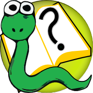

How to Think Like a Computer Scientist
======================================

Learning with Python 3 (RLE)
---------------------------- 

3rd Edition (Using Python 3.x)

by Peter Wentworth, Jeffrey Elkner, Allen B. Downey, and Chris Meyers

  (based on 2nd edition by Jeffrey Elkner, Allen B. Downey, and Chris Meyers)

Other variations of this book may suit you better. See http://www.openbookproject.net/thinkcs
  
Corresponding author: p.wentworth@ru.ac.za

Source for this RLE version:  https://code.launchpad.net/~thinkcspy-rle-team/thinkcspy/thinkcspy3-rle

.. toctree::
    :maxdepth: 1

    copyright.rst
    foreword.rst
    preface.rst
    preface3-rle.rst
    contrib.rst
    way_of_the_program.rst
    variables_expressions_statements.rst
    hello_little_turtles.rst
    functions.rst
    conditionals.rst
    fruitful_functions.rst
    iteration.rst
    strings.rst
    tuples.rst
    events.rst
    lists.rst
    modules.rst
    files.rst
    list_algorithms.rst
    classes_and_objects_I.rst
    classes_and_objects_II.rst
    pygame.rst
    recursion.rst
    exceptions.rst
    dictionaries.rst
    even_more_oop.rst
    sets.rst
    inheritance.rst
    linked_lists.rst
    stacks.rst
    queues.rst
    trees.rst
    app_a.rst
    app_b.rst
    app_c.rst
    app_d.rst
    fdl-1.3.rst

